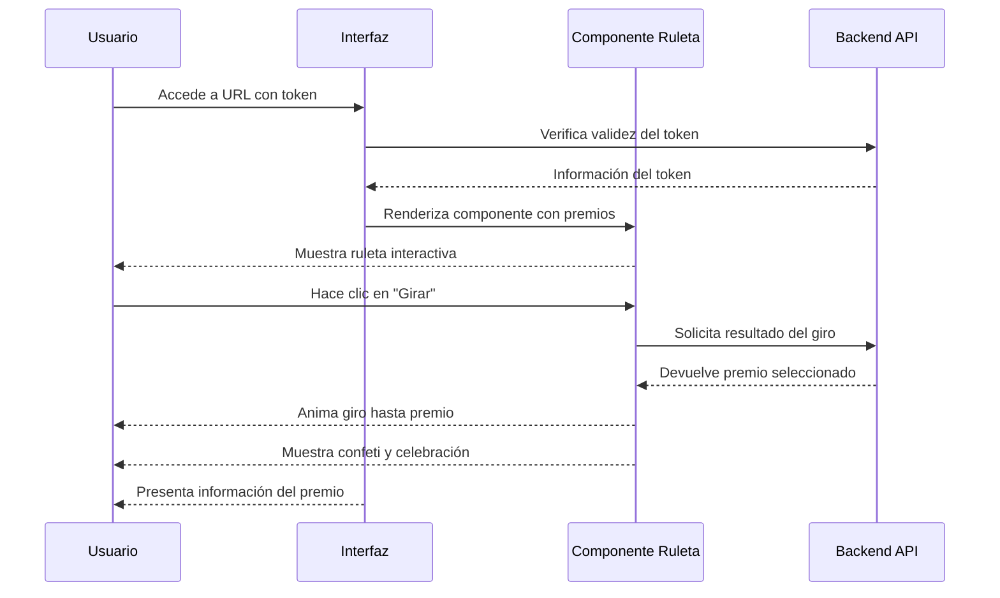

# Sistema de Layouts - Documentación Técnica

## 1. Introducción

Este documento describe la arquitectura y el funcionamiento del sistema de layouts implementado en la aplicación, mejorando la organización del código y la experiencia del usuario.

## 2. Sistema de Layouts

### 2.1 Arquitectura de Layouts

La aplicación utiliza un sistema de layouts específicos para cada sección, mejorando la organización del código y la experiencia del usuario. El sistema se basa en el App Router de Next.js y utiliza diferentes layouts para las distintas secciones de la aplicación:

```
src/app/
├── layout.tsx                # Layout raíz (fallback)
├── admin/
│   ├── layout.tsx            # Layout específico para admin
│   └── login/
│       └── layout.tsx        # Layout específico para login de admin
├── (marketing)/
│   └── layout.tsx            # Layout para marketing y home
├── (standalone)/
│   └── layout.tsx            # Layout minimalista para vistas independientes
└── lounge/
    └── layout.tsx            # Layout para el área de lounge
```

### 2.2 Características Principales

#### 2.2.1 Layout Específico para Admin

El layout de administración (`admin/layout.tsx`) proporciona:

- Cabecera específica para administradores con navegación intuitiva
- Enlaces a las secciones principales: Batches, Tokens, Premios
- Soporte para modo oscuro/claro adaptable
- Navegación sin recargas mediante el sistema de enlaces de Next.js

#### 2.2.2 Layout de Marketing

El layout de marketing (`(marketing)/layout.tsx`) está optimizado para:

- Presentación visual atractiva orientada al usuario final
- Soporte para fondos personalizados y elementos visuales avanzados
- Carga optimizada de componentes para mejorar el rendimiento
- Adaptación completa a dispositivos móviles

#### 2.2.3 Layout Independiente para Login

El layout específico para login (`admin/login/layout.tsx`):

- Elimina la navegación de administración para usuarios no autenticados
- Presenta una interfaz limpia centrada en el formulario de acceso
- Mejora la seguridad al no exponer elementos de navegación

### 2.3 Mejoras Implementadas

La arquitectura de layouts actual resuelve diversos problemas previos:

1. **Eliminación de detección JavaScript**: Se ha eliminado el antiguo sistema que utilizaba JavaScript para detectar rutas y modificar estilos, reemplazándolo con layouts específicos que se cargan de forma estática.

2. **Prevención de parpadeos**: Al eliminar la modificación dinámica del DOM después del renderizado inicial, se ha eliminado el efecto de parpadeo que ocurría en ciertos escenarios.

3. **Separación de responsabilidades**: Cada sección tiene su propio layout con sus estilos y componentes específicos, facilitando el mantenimiento y la evolución del código.

4. **Mejora de rendimiento**: La carga específica de componentes por sección reduce la cantidad de JavaScript necesario para cada página.

### 2.4 Política de `globals.css` Unificada (2025-09)

Para evitar inconsistencias y 404 de chunks CSS huérfanos observados en desarrollo:

- `globals.css` se importa **una sola vez** en `src/app/layout.tsx`.
- Ninguna página o layout secundario debe volver a importarlo, salvo layouts realmente "standalone" que definan su propio `<html>` y se aíslen intencionalmente (por ejemplo: `lounge`, `(standalone)/fiesta`). Incluso en esos casos se recomienda evaluar si pueden heredar del root para simplificar.
- No duplicar `<html>`, `<head>` o `<body>` en layouts anidados. Sólo el root (o un layout totalmente standalone) debe declararlos.
- El layout de marketing mantiene independencia visual y su propio `<head>` pero ya no re-importa `globals.css`; si requiere aislamiento adicional se documentará explícitamente.

Beneficios:

1. Elimina solicitudes a `/_next/static/css/.../layout.css` obsoletas tras refactors.
2. Reduce parpadeos (FOUC) y recargas completas al hacer Fast Refresh.
3. Simplifica el árbol de dependencias CSS para Tailwind.
4. Facilita pruebas E2E de integridad de estilos.

### 2.5 Test E2E de integridad de estilos

Se añadió `tests/e2e/admin-login-css.spec.ts` para verificar:

- Que `/admin/login` no emite 404 de chunks CSS.
- Que las utilidades globales (ej. clase `antialiased`) están presentes.
- Que no hay errores de consola inesperados.

Este test sirve como guardrail ante regresiones en la política de importación.

## 3. Flujo de Usuario

### 3.1 Flujo Típico



### 3.2 Estados de la Ruleta

La ruleta puede presentarse en varios estados:
- **Estado inicial**: Esperando interacción del usuario
- **Girando**: Animación en progreso, botón deshabilitado
- **Resultado**: Muestra el premio ganado con animación de celebración
- **Error**: Muestra mensaje amigable si ocurre algún problema

## 4. Consideraciones Técnicas

### 4.1 Rendimiento

- Las animaciones utilizan propiedades CSS optimizadas para rendimiento (transform, opacity)
- Se implementa lazy loading de componentes pesados
- Se evita la rehidratación innecesaria entre rutas

### 4.2 Accesibilidad

- Todos los componentes incluyen atributos ARIA apropiados
- Se soporta navegación por teclado
- Los colores cumplen con relaciones de contraste adecuadas

### 4.3 Compatibilidad entre navegadores

- Se incluyen prefijos CSS cuando es necesario
- Se utilizan polyfills para características modernas
- Se ha probado en Chrome, Firefox, Safari y Edge

## 5. Conclusiones

La implementación actual del sistema de layouts proporciona una base sólida y extensible para la aplicación, resolviendo problemas previos de inconsistencia visual y mejorando significativamente la experiencia del usuario. La arquitectura modular facilita el mantenimiento y las futuras ampliaciones del sistema.
