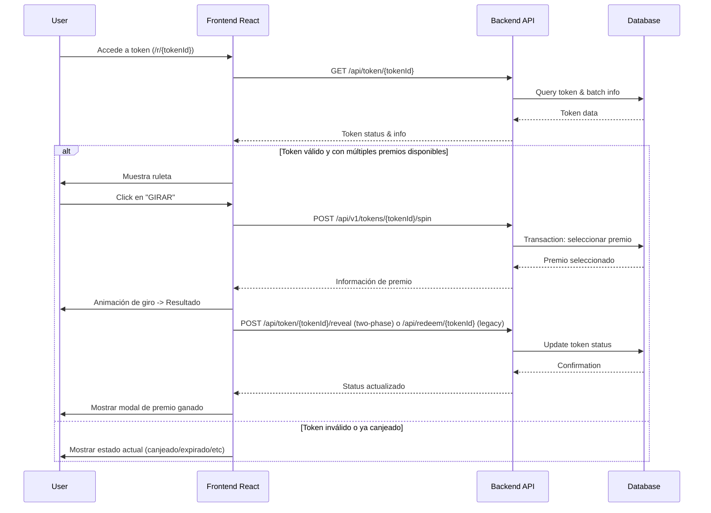
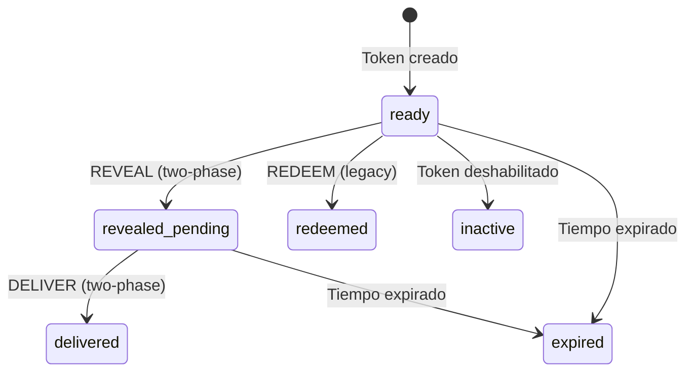

# Sistema de Ruleta de Tokens - Documentación Técnica

## 1. Introducción

El sistema de ruleta de tokens es un componente central de la aplicación que proporciona una experiencia interactiva para la revelación y canje de premios. La ruleta implementa una interfaz visual atractiva que permite a los usuarios girar y obtener premios de forma aleatoria pero ponderada, basándose en la disponibilidad real de tokens y premios en el sistema.

## 2. Arquitectura General

### 2.1 Componentes Principales

El sistema de ruleta está implementado siguiendo una arquitectura modular:

```
src/
├── components/
│   └── roulette/           # Componentes de UI de la ruleta
│       ├── NewRoulette.tsx        # Componente principal de la ruleta
│       ├── RouletteFrame.tsx      # Marco decorativo
│       ├── RoulettePointer.tsx    # Indicador de selección
│       ├── RouletteSegments.tsx   # Generador de segmentos
│       ├── SpinButton.tsx         # Botón de giro
│       ├── types.ts               # Definiciones de tipos
│       └── roulette.module.css    # Estilos CSS
├── app/
│   ├── r/
│   │   └── [tokenId]/     # Rutas para tokens individuales
│   │       ├── TokenPlayRedeem.tsx # Lógica de UI para redención
│   │       ├── RedeemView.tsx      # Vista de redención
│   │       └── page.tsx            # Punto de entrada de la ruta
│   └── api/
│       └── roulette/      # Endpoints de API para ruleta
│           ├── route.ts            # Creación de sesiones
│           └── [id]/
│               ├── route.ts        # GET/POST para spin
│               └── cancel/
│                   └── route.ts    # Cancelación de sesión
```

### 2.2 Flujo de Datos



## 3. Componentes de UI

### 3.1 NewRoulette

Componente React principal que coordina la visualización y animación de la ruleta.

**Props principales:**
- `elements: RouletteElement[]` - Array de elementos a mostrar en la ruleta
- `onSpin: () => void` - Callback ejecutado al iniciar el giro
- `onSpinEnd: (prize: RouletteElement) => void` - Callback al terminar el giro
- `spinning: boolean` - Estado de giro activo
- `prizeIndex: number | null` - Índice del premio seleccionado

**Funcionamiento interno:**
- Calcula la rotación basada en el índice del premio
- Anima la ruleta mediante CSS transitions
- Maneja los callbacks para iniciar/finalizar el giro

### 3.2 RouletteSegments

Genera los segmentos SVG de la ruleta basados en los elementos proporcionados.

**Algoritmo de generación de segmentos:**
1. Calcula el ángulo de cada segmento (360° / número de elementos)
2. Para cada elemento, genera una ruta SVG (path) que:
   - Comienza en el centro
   - Dibuja un arco según el ángulo correspondiente
   - Vuelve al centro
3. Añade el texto de la etiqueta con rotación para alinearlo con el segmento

### 3.3 Animación de Giro

La animación se implementa mediante CSS Transitions en `roulette.module.css`:

```css
.wheel.spinning {
  transition: transform 6s cubic-bezier(0.1, 0.1, 0.25, 1);
}
```

La curva de Bezier proporciona una desaceleración natural que simula la física de una ruleta real.

## 4. Modos de Operación

El sistema soporta dos modos principales de operación:

### 4.1 Modo BY_PRIZE

- **Descripción**: Agrupa tokens por tipo de premio, mostrando la frecuencia de cada uno
- **Límites**: Máximo 12 tipos de premios, mínimo 2
- **Selección**: Se elige un premio basado en la disponibilidad ponderada

```typescript
// Ejemplo de implementación de selección ponderada
const weighted = remainingArr.map((r) => ({ id: r.prizeId, weight: r.remaining }));
const chosenPrizeId = pickWeighted(weighted);
```

### 4.2 Modo BY_TOKEN

- **Descripción**: Cada segmento representa un token específico
- **Límites**: Máximo 12 tokens en total
- **Selección**: Se elige un token aleatorio entre los disponibles

```typescript
const remainingTokens = tokensAll.slice(consumed);
const chosenIndex = Math.floor(Math.random() * remainingTokens.length);
const chosenToken = remainingTokens[chosenIndex];
```

## 5. Backend: API y Lógica de Negocio

### 5.1 Endpoints de API

| Endpoint | Método | Descripción |
|----------|--------|-------------|
| `/api/roulette` | POST | Crea una nueva sesión de ruleta |
| `/api/roulette/{id}` | GET | Obtiene estado de una sesión |
| `/api/roulette/{id}` | POST | Realiza un giro en la sesión |
| `/api/roulette/{id}/cancel` | POST | Cancela una sesión |
| `/api/token/{id}/reveal` | POST | Marca token como revelado (two-phase) |
| `/api/token/{id}/deliver` | POST | Marca token como entregado (two-phase) |
| `/api/redeem/{id}` | POST | Canjea token directamente (legacy) |

### 5.2 Ciclo de Vida de una Sesión de Ruleta

1. **Creación**:
   - Se verifica el batch y sus tokens disponibles
   - Se determina el modo (BY_PRIZE o BY_TOKEN)
   - Se crea un snapshot inicial del estado

2. **Operación**:
   - Cada giro actualiza:
     - El contador de giros (`spins`)
     - Tokens consumidos
     - Historial de giros (`spinsHistory`)

3. **Finalización**:
   - Una sesión se marca como FINISHED cuando:
     - Se han consumido todos los tokens (BY_TOKEN)
     - Se han consumido todos los premios (BY_PRIZE)
     - Se cancela manualmente

### 5.3 Flujos de Redención

#### 5.3.1 Flujo Legacy (una fase)

1. Girar ruleta
2. Asignar premio
3. Establecer `redeemedAt` inmediatamente

#### 5.3.2 Flujo Two-Phase

1. **REVEAL**: Al girar la ruleta
   - Establecer `revealedAt` y `assignedPrizeId`
   - Mostrar premio al usuario

2. **DELIVER**: Acción de staff
   - Establecer `deliveredAt`
   - Copiar `deliveredAt` a `redeemedAt` para compatibilidad

## 6. Manejo de Estados y Persistencia

### 6.1 Estados de Token

| Estado | Campo en BD | Descripción |
|--------|-------------|-------------|
| `ready` | N/A | Listo para canje |
| `revealed_pending` | `revealedAt != null && deliveredAt == null` | Revelado, pendiente de entrega |
| `delivered` | `deliveredAt != null` | Entregado (two-phase) |
| `redeemed` | `redeemedAt != null` | Canjeado (legacy) |
| `expired` | `expiresAt < now` | Expirado |
| `inactive` | `disabled == true || prize.active == false` | Inactivo |
| `not_found` | N/A | Token no existe |
| `system_off` | N/A | Sistema desactivado |

### 6.2 Esquema de Base de Datos

Tablas principales relacionadas con la ruleta:

```prisma
model RouletteSession {
  id           String         @id @default(cuid())
  batchId      String
  mode         String         // "BY_PRIZE" o "BY_TOKEN"
  status       String         // "ACTIVE", "FINISHED" o "CANCELLED"
  spins        Int            @default(0)
  maxSpins     Int
  meta         String         // JSON snapshot
  createdAt    DateTime       @default(now())
  finishedAt   DateTime?
  spinsHistory RouletteSpin[]
  batch        Batch          @relation(fields: [batchId], references: [id])
}

model RouletteSpin {
  id            String          @id @default(cuid())
  sessionId     String
  prizeId       String
  order         Int
  weightSnapshot Int
  tokenId       String?
  createdAt     DateTime        @default(now())
  session       RouletteSession @relation(fields: [sessionId], references: [id])
}

model Token {
  id              String    @id
  batchId         String
  prizeId         String
  disabled        Boolean   @default(false)
  expiresAt       DateTime
  redeemedAt      DateTime?
  revealedAt      DateTime? // Two-phase: marca cuando se reveló el premio
  deliveredAt     DateTime? // Two-phase: marca cuando se entregó físicamente
  assignedPrizeId String?   // Two-phase: puede diferir de prizeId original
  // Relaciones...
}
```

## 7. Seguridad y Consistencia

### 7.1 Transacciones

Las operaciones críticas se ejecutan dentro de transacciones para garantizar la consistencia de datos:

```typescript
const result = await prisma.$transaction(async (tx: any) => {
  // Operaciones atómicas
});
```

### 7.2 Rate Limiting

Se implementa limitación de tasa para prevenir abusos:

```typescript
const rl = checkRateLimit(`rouletteSpin:${ip}`);
if (!rl.ok) {
  return new Response(
    JSON.stringify({ error: "RATE_LIMIT", retryAfterSeconds: rl.retryAfterSeconds }),
    { status: 429, headers: { "Retry-After": rl.retryAfterSeconds.toString() } }
  );
}
```

### 7.3 Prevención de Condiciones de Carrera

- Uso de transacciones de base de datos
- Estado explícito para sesiones y tokens
- Actualizaciones atómicas con condiciones WHERE

## 8. Auditoría y Métricas

### 8.1 Eventos Registrados

| Tipo de Evento | Descripción | Datos Capturados |
|----------------|-------------|------------------|
| `ROULETTE_CREATE` | Creación de ruleta | sessionId, batchId, mode, prizes, totalTokens |
| `ROULETTE_SPIN` | Giro de ruleta | sessionId, prizeId, order, remainingTotal, finished |
| `TOKEN_REVEALED` | Token revelado | tokenId, prizeId, assignedPrizeId, revealedAt |
| `ROULETTE_FINISH` | Fin de sesión | sessionId, totalSpins, distribution |

### 8.2 Análisis de Distribución

Al finalizar una sesión, se calculan estadísticas de distribución:

```typescript
const distribution = computeDistribution(snapshot, spinsHistory, chosenPrizeId);
```

La función `computeDistribution` analiza:
- Distribución esperada vs real
- Estadísticas chi-cuadrado para verificar aleatoriedad
- Desviaciones significativas

## 9. Control y Configuración

### 9.1 Scheduler de Tokens

El sistema incluye un scheduler que controla la disponibilidad general de tokens:

- **18:00**: Activa tokens (`tokensEnabled = true`)
- **00:00**: Desactiva tokens (`tokensEnabled = false`)

### 9.2 Modo Pruebas

Permite habilitar tokens independientemente del horario programado:

```typescript
// Regla de prioridad
if (opts.tokensTestMode) return { enabled: true, reason: 'test-mode' };
```

### 9.3 Modo Admin-Disable

Permite a los administradores desactivar completamente el sistema:

```typescript
if (opts.tokensAdminDisabled) return { enabled: false, reason: 'admin-disabled' };
```

## 10. Implementación de Componentes Clave

### 10.1 Algoritmo de Selección Ponderada

```typescript
// src/lib/pickWeighted.ts
export function pickWeighted<T extends { id: string; weight: number }>(
  items: T[]
): string | null {
  if (!items.length) return null;
  const totalWeight = items.reduce((sum, item) => sum + item.weight, 0);
  if (totalWeight === 0) return items[0].id;
  
  let random = Math.random() * totalWeight;
  for (const item of items) {
    random -= item.weight;
    if (random <= 0) return item.id;
  }
  return items[items.length - 1].id;
}
```

### 10.2 Cálculo de Posición Final de Ruleta

```typescript
// Algoritmo para determinar el ángulo final basado en el índice del premio
const calculatePrizeRotation = (
  prizeIndex: number, 
  elementsCount: number,
  fullSpins = 5
): number => {
  // Ángulo por segmento
  const segmentAngle = 360 / elementsCount;
  
  // Calcular ángulo base del premio (posición central del segmento)
  const baseAngle = 360 - (prizeIndex * segmentAngle + segmentAngle / 2);
  
  // Añadir giros completos para efecto visual
  return baseAngle + (fullSpins * 360);
};
```

## 11. Mejoras en el Componente SpinButton

### 11.1 Problemas Identificados

El componente SpinButton original presentaba problemas de detección de eventos debido a áreas transparentes bloqueantes en el SVG, inconsistencia visual y funcional, y problemas de accesibilidad.

### 11.2 Soluciones Implementadas

#### Rediseño del SVG
- Eliminación de áreas transparentes bloqueantes
- Geometría simplificada con `pointer-events` optimizados
- Cambio de `div` a `button` semántico

#### Mejoras de Accesibilidad
- Atributos ARIA (`aria-label`)
- Soporte para teclado y estados de foco
- Estados visuales claros (normal, hover, active, disabled)

#### Optimización de Rendimiento
- `React.memo` para evitar re-renderizados
- Animaciones CSS optimizadas
- Gestión eficiente de eventos

### 11.3 Resultados
- Experiencia de usuario consistente y predecible
- Cumplimiento de estándares WCAG
- Mejor rendimiento y mantenibilidad

## 12. Integración con Layouts

La ruleta se integra perfectamente con el sistema de layouts a través de:

1. **Carga bajo demanda**: El componente de ruleta se carga solo cuando es necesario, reduciendo el tiempo de carga inicial.

2. **Adaptación al contexto**: La presentación visual se adapta automáticamente según el contexto (marketing, admin, etc.).

3. **Consistencia visual**: Se mantiene la coherencia de estilo con el resto de la aplicación.

## 13. Manejo de Errores

### 11.1 Errores de API

| Código | Descripción |
|--------|-------------|
| `BAD_JSON` | JSON inválido en el cuerpo de la petición |
| `BATCH_ID_REQUIRED` | Falta el ID del batch |
| `BATCH_NOT_FOUND` | Batch no encontrado |
| `ALREADY_EXISTS` | Ya existe una sesión activa para este batch |
| `NO_TOKENS` | No hay tokens disponibles |
| `NOT_ELIGIBLE` | No cumple requisitos (demasiados/pocos tokens o premios) |
| `FINISHED` | Sesión finalizada |
| `CANCELLED` | Sesión cancelada |
| `RATE_LIMIT` | Límite de tasa excedido |
| `SPIN_FAILED` | Error interno al girar |

### 11.2 Gestión de Errores en Frontend

El componente `TokenPlayRedeem.tsx` implementa manejo de errores para:

- Fallos de autenticación
- Errores de red
- Fallos en redención automática
- Estados inválidos de token

## 12. Rendimiento y Optimización

### 12.1 Lazy Loading

El componente de ruleta se carga dinámicamente para reducir el bundle inicial:

```typescript
// Carga dinámica para no inflar el server bundle
const RouletteWheel = loadDynamic(
  () => import("@/app/admin/roulette/RouletteWheel").then(m => m.RouletteWheel),
  { ssr: false }
);
```

### 12.2 Caché y Revalidación

```typescript
export const revalidate = 0; // equivalente a force-dynamic
```

### 12.3 Renderizado Condicional

Solo se muestra la ruleta cuando es necesario:

```typescript
const showRoulette = status === "ready" && wheelElements.length > 1;
```

## 13. Pruebas

### 13.1 Archivos de Test

```
src/app/api/roulette/spin.endpoint.test.ts
src/app/api/roulette/spin.concurrency.test.ts
src/app/api/roulette/spin.by_token.test.ts
```

### 13.2 Bases de Datos de Prueba

```
prisma/
  test_roulette_conc.db
  test_roulette_spin.db
  test_roulette_token.db
```

## 14. Comandos de Desarrollo y Testing

### 14.1 Testing de Modo de Tokens

```powershell
# Verificar estado actual de tokens
Invoke-RestMethod -Method Get -Uri 'http://localhost:3001/api/system/tokens/status' | ConvertTo-Json -Depth 5

# Activar modo prueba
$hdr = @{ Cookie = 'session=staff'; 'Content-Type' = 'application/json' }
$body = '{"enabled":true}'
Invoke-RestMethod -Method Post -Uri 'http://localhost:3001/api/system/tokens/test-mode' -Headers $hdr -Body $body
```

### 14.2 Testing Manual de Ruleta

```powershell
# Crear sesión de ruleta (BY_PRIZE)
$body = '{"batchId":"batch123"}'
Invoke-RestMethod -Method Post -Uri 'http://localhost:3001/api/roulette' -Headers $hdr -Body $body

# Crear sesión de ruleta (BY_TOKEN)
$body = '{"batchId":"batch123"}'
Invoke-RestMethod -Method Post -Uri 'http://localhost:3001/api/roulette?mode=token' -Headers $hdr -Body $body

# Realizar un giro
Invoke-RestMethod -Method Post -Uri 'http://localhost:3001/api/roulette/session123' -Headers $hdr
```

## 15. Consideraciones de Escalabilidad

- **Concurrencia**: El sistema está diseñado para manejar múltiples sesiones y giros simultáneos
- **Transacciones**: Las operaciones críticas están protegidas por transacciones
- **Rate Limiting**: Se implementa limitación de tasa para prevenir abusos
- **Logs**: Sistema de auditoría para monitoreo y depuración

---

## Apéndice A: Diagrama de Estados de Token



## Apéndice B: Mejores Prácticas para Extensión

1. **Nuevos Modos de Ruleta**: Extender enum de modos y agregar implementación
2. **UI Personalizada**: Los componentes están modularizados para fácil reemplazo
3. **Algoritmos de Selección**: Modificar `pickWeighted` para otras distribuciones
4. **Nuevos Flujos**: Extender los estados de token y actualizar la lógica de transición
